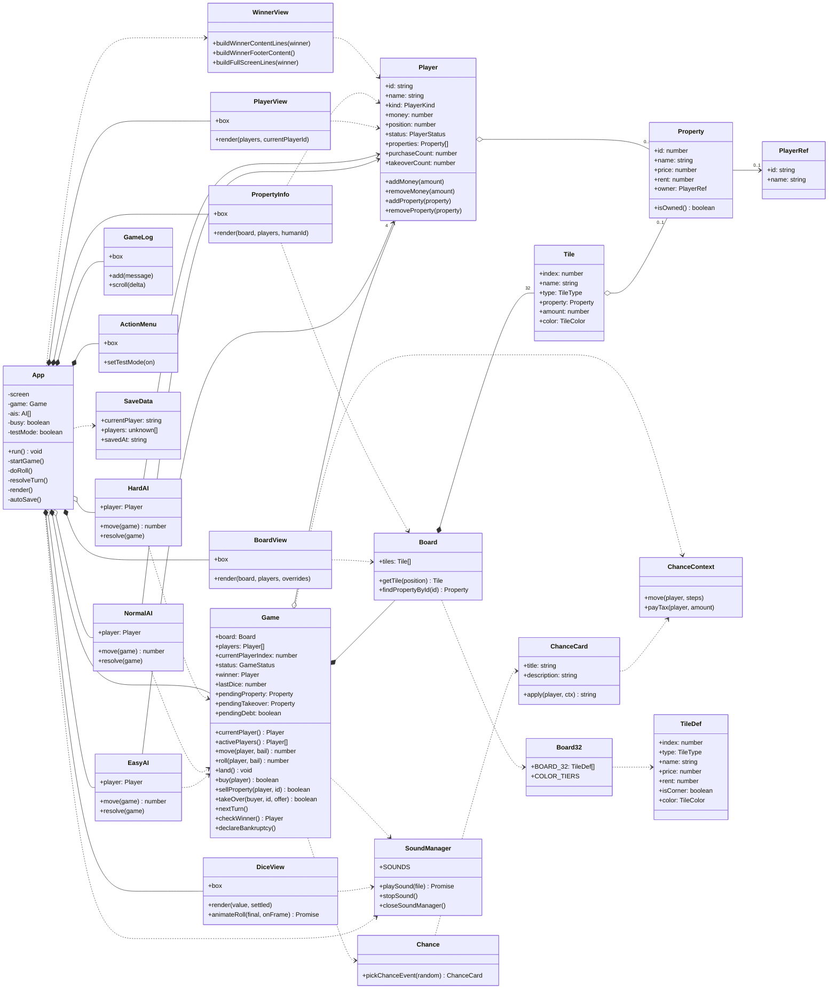

# Class Diagram 
โครงสร้างของระบบ Mini Monopoly และความสัมพันธ์ระหว่างคลาสหลัก โดยแบ่งองค์ประกอบออกดังนี้

- **Game** - จัดการกติกาและสถานะหลักของเกม เช่น การเดิน การซื้อทรัพย์สิน การ Takeover และการตรวจสอบผู้ชนะ
- **Board / Tile / Property** - จัดการกระดาน ช่องบนกระดาน และทรัพย์สินภายในเกม
- **Player** - เก็บข้อมูลผู้เล่น เงิน ตำแหน่ง สถานะ และทรัพย์สินที่ครอบครอง
- **EasyAI / NormalAI / HardAI** - จัดการการตัดสินใจของบอทแต่ละระดับ
- **App และ View ต่าง ๆ** - จัดการส่วนติดต่อผู้ใช้และการแสดงผลใน Terminal
- **Chance / ChanceCard** - จัดการระบบการ์ดเหตุการณ์ภายในเกม
- **Board32 / TileDef** - เก็บข้อมูลและโครงสร้างของกระดาน 32 ช่อง
- **SaveData / SoundManager** - จัดการข้อมูลการบันทึกเกมและระบบเสียง

---

---

